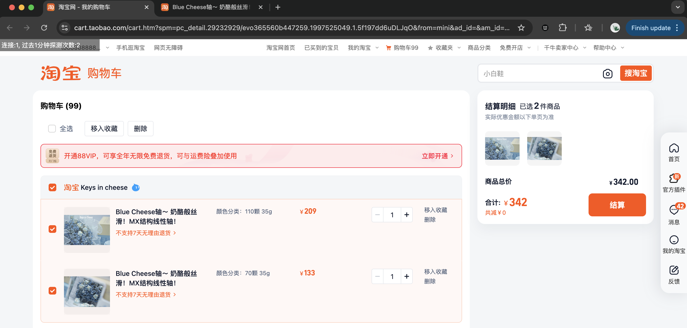

抢购方案：多人并行探测商品链接是否上架，共享探测结果。探测到已上架自动提交购物车。

QQ群交流：1002052265

### 安装

- **第1步** 插件zip包下载地址[https://github.com/boring-keyboard/sweet-switch/releases](https://github.com/boring-keyboard/sweet-switch/releases)
- **第2步** 下载后解压到本地磁盘
- **第3步** 打开chrome浏览器扩展管理页面 chrome://extensions
- **第4步** 打开开发者模式并加载插件目录
- **第5步** 加载成功后页面会出现此插件

- **第6步** 打开插件启用开关

### 使用

- **第1步** 提前将商品加入购物车
- **第2步** 打开商品详情页
- **第3步** 此时页面每30秒自动刷新一次, 用于探测是否上架, 不要关闭。
  **由于频繁刷新会触发淘宝的滑块验证机制, 如果出现滑块验证需要先完成验证**
- **第4步** 新开一个页面，打开购物车, 勾选需要结算的商品
- **第5步** 保持购物车页面打开状态, 等待自动提单（如下图所示）。页面左上角显示当前在线人数和探测次数

